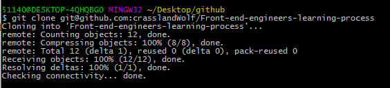

# Front-end-engineers-learning-process
##进阶的切图仔

### 首先学会使用github
##### 一、建立仓库
  New repository
##### 二、安装客户端和配置git
  首先在本地打开 git Bash 键入命令创建 ssh key :<br>

  ```
  ssh-keygen -t rsa -C "your_email@your_email.com"
  ```
  邮箱为gitghub上自己的邮箱, 之后需要要求确认路径和输入密码, 可以使用默认一直回车。成功之后会在~/下生成.ssh文件夹, 打开id_rsa.pub, 复制里面的key, 回到github, 进入settings, 选择新建一个SSH key。在git Bash 下输入命令验证是否成功.<br>

  ```
  ssh -T git@github.com 
  ```

  如果是第一次会提示是否continue, 输入yes就会看到:

  ```
  You've successfully authenticated, but GitHub does not provide shell access
  ```

  这就表示已经成功连接上github, 接下来就可以clone在github上面的仓库到本地,在此之前还需要设置username和email, 因为每次github commit都会记录他们。<br>

  ```
  git config --global user.name "your name"
  git config --global user.email "your_email@your_email.com"
  ```

##### 三、clone到本地:

  ```
  git clone git@github.com:yourname/repository
  ```

  看到下面图片的效果说明clone成功:

 
##### 四、提交
  修改完后先要add修改的文件(. 表示全部),然后填写commit, 最后再 push 到 github<br>

  ```
  git add .
  git commit -m 'update'
  git push
  ```

  以上如果报错可以按照以下命令执行:<br>

  ```
  git init
  git add .
  git commit -m "修改的相关信息"
  git remote add origin git@github.com:your_name/origin.git
  git push -u origin master
  ```

  如果仅仅是提交一个文件可以这样写:<br>

  ```
  git add README.txt
  ```

  如果更新一个目录可以这样写:
  ```
  git add src/
  ```


### 一些链接</br>
[收集网站1](http://www.kancloud.cn/jikeytang/qq/87646)
[收集网站2](http://gold.xitu.io/tag/Vue.js?utm_source=baidu&utm_medium=keyword&utm_content=frontend_vuejs&utm_campaign=q3_search)

